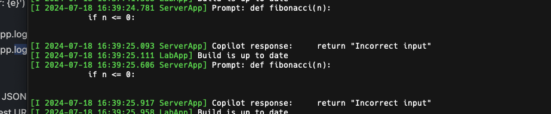
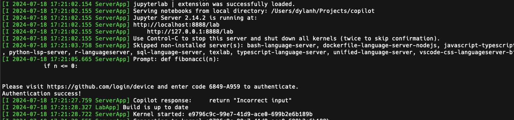
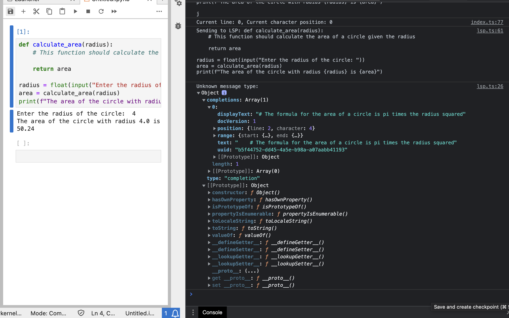

# jupyter_copilot

[](/actions/workflows/build.yml)
[](https://mybinder.org/v2/gh//main?urlpath=lab)

GitHub Copilot for Jupyter

---

This extension is composed of a Python package named `jupyter_copilot`
for the server extension and a NPM package named `jupyter_copilot`
for the frontend extension.

## **Requirements**

- JupyterLab >= 4.0.0

## Install

To install the extension, execute:

(ignore this cant actually do this yet)

```bash
pip install jupyter_copilot
```

## Uninstall

To remove the extension, execute:

```bash
pip uninstall jupyter_copilot
```

## Troubleshoot

If you are seeing the frontend extension, but it is not working, check
that the server extension is enabled:

```bash
jupyter server extension list
```

If the server extension is installed and enabled, but you are not seeing
the frontend extension, check the frontend extension is installed:

```bash
jupyter labextension list
```

## Contributing

### Development install

Note: You will need NodeJS to build the extension package.

The `jlpm` command is JupyterLab's pinned version of
[yarn](https://yarnpkg.com/) that is installed with JupyterLab. You may use
`yarn` or `npm` in lieu of `jlpm` below.

```bash
# First install jupyterlab with pip
# Clone the repo to your local environment
# Change directory to the jupyter_copilot directory
# Install package in development mode
pip install -e "."
# Link your development version of the extension with JupyterLab
jupyter labextension develop . --overwrite
# Server extension must be manually installed in develop mode
jupyter server extension enable jupyter_copilot
# Rebuild extension Typescript source after making changes
jlpm build
```

You can watch the source directory and run JupyterLab at the same time in different terminals to watch for changes in the extension's source and automatically rebuild the extension.

```bash
# Watch the source directory in one terminal, automatically rebuilding when needed
jlpm watch
# Run JupyterLab in another terminal
jupyter lab
```

With the watch command running, every saved change will immediately be built locally and available in your running JupyterLab. Refresh JupyterLab to load the change in your browser (you may need to wait several seconds for the extension to be rebuilt).

By default, the `jlpm build` command generates the source maps for this extension to make it easier to debug using the browser dev tools. To also generate source maps for the JupyterLab core extensions, you can run the following command:

```bash
jupyter lab build --minimize=False
```

### Development uninstall

```bash
# Server extension must be manually disabled in develop mode
jupyter server extension disable jupyter_copilot
pip uninstall jupyter_copilot
```

In development mode, you will also need to remove the symlink created by `jupyter labextension develop`
command. To find its location, you can run `jupyter labextension list` to figure out where the `labextensions`
folder is located. Then you can remove the symlink named `jupyter_copilot` within that folder.

### Layout and structure

The extension has two parts, the frontend that runs in the notebook which is located in `/src`, and the backend server located in `/jupyter_copilot`. The that way Jupyter works is it has a frontend notebook in the browser, then code is run by sending an API request to another server running locally which returns the code output.

### `handlers.py`

This file is the code for the server the extension will be running on. This server runs locally and will actually get the copilot completions for the frontend. Its base API route is at `http://localhost:8888/jupyter-copilot` (i think) and the only endpoint so far is `/copilot` which sends the snippet to GitHub copilot and returns the completion.

Whenever you the `jupyter lab` command, that output of that are the logs from the local Jupyter servers, which includes the one for our extension. Instead of printing to debug, instead call `logging.info`, then the output will be visible in that terminal.



This extension uses the real GitHub copilot API and requires you to sign into GitHub. This happens using native Github authentication, however this happens unprompted on startup and hangs everything since I just copied and pasted the code, which is not what we want. Once signing in the copilot token is stored in `.copilot_token` in the local directory (which I gitignored) and requests to GitHub Copilot can be made using that.



The original code for the Copilot server can be found [here](https://github.com/B00TK1D/copilot-api) and has some more information if you need it.

**When you make changes to this file `npm run watch` will not detect the change, so you need to restart the Jupyter instance in the terminal to see changes take effect**

### `index.ts` `handler.ts`

This is the frontend code that will be running in the notebook on our browser. `handler.ts` is a wrapped around HTTP requests to our server and shouldn't need to be changed. `makePostRequest` sends an HTTP post request which is that the local copilot server is configured to accept. The code in `index.ts` is the main code for out extension, and runs in the browser, so all print statements will be in the browser console. [This tutorial](https://jupyterlab.readthedocs.io/en/stable/extension/extension_tutorial.html) has a detailed guide on working with the notebook and making new elements and is something idk how to do.



## Task

Instead of randomly calling for GitHub Login, make a notebook command that will start the login process. The command should show the link to navigate to in the notebook as well as the code that you have to enter. This will require adding the command element (should be in the tutorial) and refactoring `handlers.py` to call the `get_token` only when this command is run. This means adding a guard for the `/copilot` route that returns an error if not GitHub is not logged in, and creating a new POST route that will actually invoke the login process.

### Packaging the extension

See [RELEASE](RELEASE.md)
