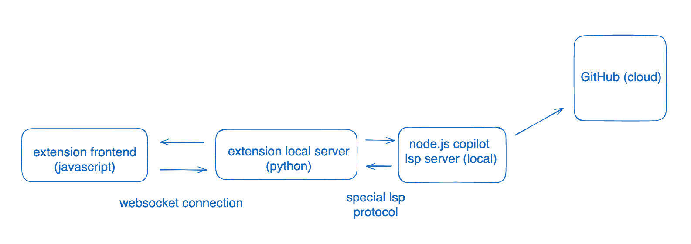
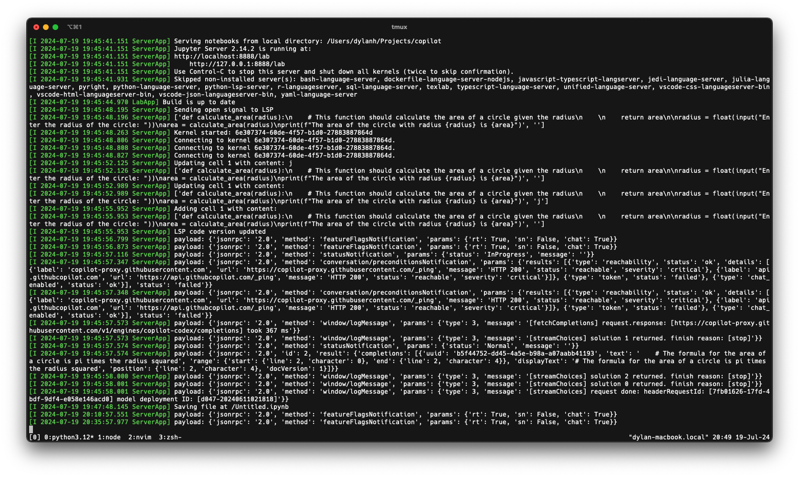

# jupyter_copilot

[](/actions/workflows/build.yml)
[](https://mybinder.org/v2/gh//main?urlpath=lab)

GitHub Copilot for Jupyter

---

This extension is composed of a Python package named `jupyter_copilot`
for the server extension and a NPM package named `jupyter_copilot`
for the frontend extension.

## **Requirements**

- JupyterLab >= 4.0.0

## Install

To install the extension, execute:

(ignore this cant actually do this yet)

```bash
pip install jupyter_copilot
```

## Uninstall

To remove the extension, execute:

```bash
pip uninstall jupyter_copilot
```

## Troubleshoot

If you are seeing the frontend extension, but it is not working, check
that the server extension is enabled:

```bash
jupyter server extension list
```

If the server extension is installed and enabled, but you are not seeing
the frontend extension, check the frontend extension is installed:

```bash
jupyter labextension list
```

## Contributing

### Development install

Note: You will need NodeJS to build the extension package.

The `jlpm` command is JupyterLab's pinned version of
[yarn](https://yarnpkg.com/) that is installed with JupyterLab. You may use
`yarn` or `npm` in lieu of `jlpm` below.

```bash
# First install jupyterlab with pip
# Clone the repo to your local environment
# Change directory to the jupyter_copilot directory
# Install package in development mode
pip install -e "."
# Link your development version of the extension with JupyterLab
jupyter labextension develop . --overwrite
# Server extension must be manually installed in develop mode
jupyter server extension enable jupyter_copilot
# Rebuild extension Typescript source after making changes
jlpm build
```

You can watch the source directory and run JupyterLab at the same time in different terminals to watch for changes in the extension's source and automatically rebuild the extension.

```bash
# Watch the source directory in one terminal, automatically rebuilding when needed
jlpm watch
# Run JupyterLab in another terminal
jupyter lab
```

With the watch command running, every saved change will immediately be built locally and available in your running JupyterLab. Refresh JupyterLab to load the change in your browser (you may need to wait several seconds for the extension to be rebuilt).

By default, the `jlpm build` command generates the source maps for this extension to make it easier to debug using the browser dev tools. To also generate source maps for the JupyterLab core extensions, you can run the following command:

```bash
jupyter lab build --minimize=False
```

### Development uninstall

```bash
# Server extension must be manually disabled in develop mode
jupyter server extension disable jupyter_copilot
pip uninstall jupyter_copilot
```

In development mode, you will also need to remove the symlink created by `jupyter labextension develop`
command. To find its location, you can run `jupyter labextension list` to figure out where the `labextensions`
folder is located. Then you can remove the symlink named `jupyter_copilot` within that folder.

### Layout and structure

There a tutorial [here](https://jupyterlab.readthedocs.io/en/latest/extension/extension_tutorial.html) which should have everything you need to make extensions.

The extension has two parts, the frontend that runs in the notebook which is located in `/src`, and the backend server located in `/jupyter_copilot`. The that way Jupyter works is it has a frontend notebook in the browser, then a local server that the notebook can make requests to.



At a high level there are three parts, the extension frontend which runs in the notebook, the extension local server that handles logic and processes, and the Copilot LSP server which actually creates the Copilot completions.

The frontend and local server are connected to each other via websocket so they can communicate with each other. Whenever changes in a notebook are made or a completion should be generated the frontend will send a message to the local server to do that.

The purpose of the local server is to keep track of updates from the frontend, and communicate with the LSP server. When the frontend wants a completion the local server will forward it to the LSP and send the result back to the frontend.

The node.js copilot server is a LSP server that will actually invoke GitHub Copilot endpoints. I did not write it, and it is contained in a [node package](https://www.npmjs.com/package/copilot-node-server?activeTab=dependents), and was taken from the vim implementation of copilot.

## `src/`

This is where all the frontend code lives. In `index.js` is the main code and event listeners, that listen for changes in notebook such as content change, adding and deleting cells, and opening and closing notebooks. When one of these events happens there's some logic that needs to be send to the local server, the interface with the local server is in `lsp.ts` which has the relevant methods to send messages to the local server.


Whenever a cell is added, swapped, removed, or changed the frontend will send a message to the local server to update its representation of the notebook. Currently `Ctrl+J` will call a completion for whever the cursor is located by calling the `getCompletionAtCursorMethod`.

## `jupyter_copilot`

This is the code for the local server. `handler.py` has the handles any websocket messages from the frontend through a queue as to not break stuff. The handling of websocket messages is done in `NotebookLSPHandler`. There is another class `NotebookHandler` which creates an in-memory representation of the code from a notebook. This works by having an array for each code block, then indexing into the array and changing its content when theres an update. There is a single instance of this class and all updates in `handlers.py` update the instantiated class. This class will also make calls communicate with the LSP.

The actual node.js Copilot LSP server is spawned in as a process in `lsp.py`. The server is located in `node_modules/copilot-node-server/dist/copilot/language-server.js` and is spawned as. `lsp.py` provides an interface to communicate with this LSP server, and is basically done and not important.

Whenever you the `jupyter lab` command, that output of that are the logs from the local Jupyter servers, which includes the one for our extension. Instead of printing to debug, instead call `logging.info`, then the output will be visible in that terminal.



Stuff prepended with _payload_ and _jsonrpc_ is the output from the language server

**When you make changes to this folder `npm run watch` will not detect the change, so you need to restart the Jupyter instance in the terminal to see changes take effect**

## TODO

- There is no way to get authenticated with GitHub at the moment. I have no idea how the LSP server handles authentication, but it uses the same scheme as the Copilot.vim plugin which is why it works for me. This [stack overflow](https://stackoverflow.com/a/77659136) perfectly explains it and tells you exactly where to find the implementation of it. There should be a command in the command palette that when run, signs the user in through GitHub with the authentication code. This will require making a new UI element, and a new HTTP handler called `login` or something on the local python server. #update Authentication happens by sending a Request to the LSP server with the message, "signInConfirm" "signInInitiate" "signInWithGithubToken" or "signOut". All the code to send these messages is there, this should be easy to do.
- There should be a setting somewhere to deactivate the plugin
- Run tests and find bugs
- Test if it works in regular jupyter and port it

### Packaging the extension

See [RELEASE](RELEASE.md)
